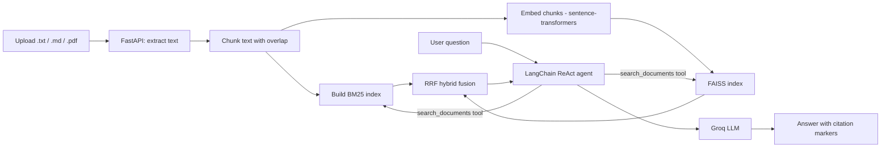

# RAG Pipeline


A full-stack, agentic Retrieval-Augmented Generation app for asking questions over uploaded documents.
A LangChain ReAct agent decides when and how to search a per-session FAISS + BM25 hybrid index,
then answers with inline, verifiable citations.

## How It Works



## Architecture

| Layer | Technology |
| --- | --- |
| Frontend | React 18, Vite |
| Backend | **FastAPI** (Python) |
| Agent orchestration | **LangChain ReAct agent** (`langchain-groq`) |
| Dense retrieval | **FAISS** (`IndexFlatIP`) over `sentence-transformers` embeddings |
| Lexical retrieval | **BM25** (`rank-bm25`) |
| Hybrid fusion | Reciprocal Rank Fusion (RRF) |
| PDF parsing | `pypdf` |
| LLM | Groq API |
| Session isolation | Per-session FAISS + BM25 indices, keyed by `X-Session-Id` header |

See [`backend/README.md`](backend/README.md) for backend setup and API details.

## Features

- Drag-and-drop upload for `.txt`, `.md`, and `.pdf`, indexed server-side
- FAISS dense retrieval + BM25 lexical retrieval, fused with Reciprocal Rank Fusion
- A LangChain ReAct agent that can issue multiple searches per turn before answering
- Inline `[N]` citation markers backed by the exact chunks the agent retrieved
- Multi-turn conversation memory
- Per-session vector-store isolation (no cross-user document leakage), with idle-session eviction
- Configurable Top-K retrieval slider
- Streaming response delivery over SSE

## Getting Started

### Backend (FastAPI + FAISS + LangChain)

```bash
cd backend
python -m venv .venv && source .venv/bin/activate
pip install -r requirements.txt
cp .env.example .env
# add your GROQ_API_KEY to backend/.env
uvicorn app.main:app --reload --port 8000
```

### Frontend

```bash
npm install
cp .env.example .env
# set VITE_API_BASE_URL if the backend isn't on localhost:8000
npm run dev
```

## Configuration

| Parameter | Default | Where | Description |
| --- | ---: | --- | --- |
| Chunk size | `400` words | Backend | Words per chunk, 20% overlap |
| Top-K | `5` | UI slider | Chunks the agent's search tool returns per query |
| Embedding model | `all-MiniLM-L6-v2` | Backend `.env` | `sentence-transformers` model for FAISS |
| LLM model | `openai/gpt-oss-120b` | UI selector | Groq chat model used by the agent |
| RRF `k` | `60` | Backend code | Reciprocal Rank Fusion constant |

## Project Structure

```text
.
|-- backend/
|   |-- app/
|   |   |-- main.py          # FastAPI routes
|   |   |-- agent.py         # LangChain ReAct agent
|   |   `-- vector_store.py  # FAISS + BM25 hybrid store, per-session isolation
|   |-- requirements.txt
|   `-- README.md
|-- public/
|-- src/
|   |-- api.js               # FastAPI client
|   |-- App.jsx
|   `-- main.jsx
|-- .env.example
|-- package.json
`-- vite.config.js
```
