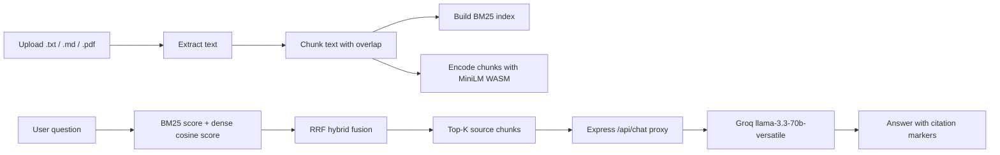
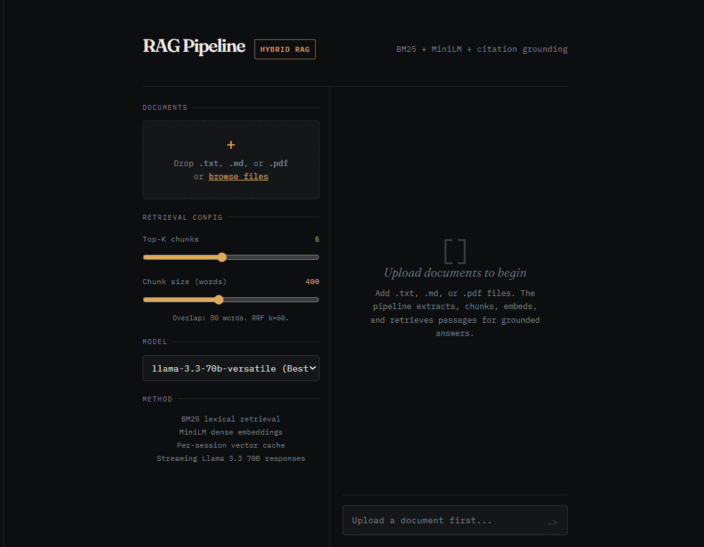

# RAG Pipeline


A full-stack Retrieval-Augmented Generation app for asking questions over uploaded documents.
Hybrid retrieval runs in the browser, while the Express backend keeps Groq API calls off the client.

## How It Works



## Features

- Drag-and-drop upload for `.txt`, `.md`, and `.pdf`
- PDF text extraction with `pdfjs-dist`
- Configurable chunk size with 20% overlap
- Pure JavaScript BM25 retrieval with `k1=1.5`, `b=0.75`
- In-browser dense embeddings with `@xenova/transformers`
- Hybrid retrieval using Reciprocal Rank Fusion
- Configurable Top-K retrieval slider
- Inline citation markers like `[1]` and `[2]`
- Citation cards showing the source chunk used
- Multi-turn conversation memory using the last 4 turns
- Streaming-style response rendering from the local proxy
- Per-session vector store with cached document embeddings
- Live index stats for docs, chunks, chunk size, and Top-K

## Getting Started

```bash
git clone <your-repo-url>
cd my-rag
npm install
cp .env.example .env
```

Add your Groq API key to `.env`:

```env
GROQ_API_KEY=your_groq_api_key_here
VITE_APP_TITLE=RAG Pipeline
```

Start the app:

```bash
npm run dev
```

The frontend runs on Vite, and `/api` requests are proxied to the Express backend on port `3001`.

## Screenshot



## Retrieval Pipeline

The app retrieves context using both lexical and semantic matching. BM25 finds chunks that share important query terms, while MiniLM embeddings find chunks with similar meaning even when the wording differs. Reciprocal Rank Fusion combines both rankings so the final context is less dependent on one retrieval method.

## Configuration

| Parameter | Default | Where | Description |
| --- | ---: | --- | --- |
| Chunk size | `400` words | UI slider | Number of words per chunk |
| Overlap | `20%` | Derived from chunk size | Shared words between adjacent chunks |
| Top-K | `5` | UI slider | Number of chunks sent to the LLM |
| BM25 `k1` | `1.5` | Code | Term frequency saturation |
| BM25 `b` | `0.75` | Code | Document length normalization |
| Embedding model | `all-MiniLM-L6-v2` | Code | In-browser sentence transformer |
| LLM model | `llama-3.3-70b-versatile` | UI selector | Groq chat model |

## Tech Stack

| Layer | Technology |
| --- | --- |
| Frontend | React 18, Vite |
| Backend | Node.js, Express |
| LLM | Groq API |
| Default model | `llama-3.3-70b-versatile` |
| Lexical retrieval | BM25 in JavaScript |
| Dense retrieval | `@xenova/transformers`, `all-MiniLM-L6-v2` |
| PDF parsing | `pdfjs-dist` |
| Hybrid fusion | Reciprocal Rank Fusion |
| Styling | CSS-in-JS, dark terminal aesthetic |

## Project Structure

```text
.
|-- public/
|   |-- favicon.svg
|   `-- icons.svg
|-- server/
|   `-- index.js
|-- src/
|   |-- assets/
|   |-- App.css
|   |-- App.jsx
|   |-- index.css
|   `-- main.jsx
|-- .env.example
|-- eslint.config.js
|-- index.html
|-- package.json
`-- vite.config.js
```

## Environment

```env
GROQ_API_KEY=
VITE_APP_TITLE=RAG Pipeline
```

The API key is used only by the backend proxy. The browser never calls Groq directly.